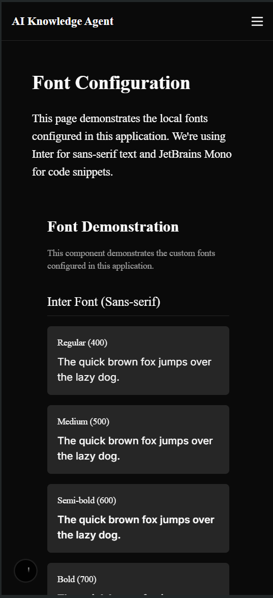

# AI Search Knowledge Agent

A Next.js 15 application that provides AI-powered search and knowledge management using Exa API and Supabase. The project is designed to be a comprehensive solution for building advanced search capabilities with a focus on performance, SEO, and user experience. It includes a responsive UI, authentication with multiple providers, and a vector database for semantic search.

This project is built with the latest features of Next.js, including the App Directory, Server Components, and Edge Functions. It leverages Supabase for database management and authentication, and Exa API for advanced AI search capabilities.

This project is designed to be a comprehensive solution for building advanced search capabilities with a focus on performance, SEO, and user experience. It includes a responsive UI, authentication with multiple providers, and a vector database for semantic search.

<p align="center">
  
</p>

<table>
  <tr>
    <td width="40%"></td>
    <td width="60%"></td>
  </tr>
</table>

## Table of Contents

- [AI Search Knowledge Agent](#ai-search-knowledge-agent)
  - [Table of Contents](#table-of-contents)
  - [Features](#features)
  - [Getting Started](#getting-started)
    - [Prerequisites](#prerequisites)
    - [Installation](#installation)
  - [Project Structure](#project-structure)
  - [Environment Variables](#environment-variables)
  - [Testing](#testing)
  - [Performance Optimization](#performance-optimization)
  - [Deployment](#deployment)
  - [Recent Enhancements](#recent-enhancements)
    - [Environment Variables Validation Script](#environment-variables-validation-script)
    - [Edge Function Integration Tests](#edge-function-integration-tests)
    - [Bundle Size Optimization](#bundle-size-optimization)
  - [License](#license)

## Features

- Advanced AI search capabilities via Exa API
- Vector database for semantic search using Supabase
- Authentication with multiple providers
- Responsive UI with dark/light mode
- Optimized for performance and SEO
- Environment variables validation for secure deployment
- Comprehensive test suite for Edge Functions
- Production-optimized build with minimal bundle size

## Getting Started

### Prerequisites

- Node.js 18.17.0 or later
- Supabase account
- Exa API key

### Installation

1. Clone the repository

```bash
git clone https://github.com/yourusername/ai-search-knowledge-agent.git
cd ai-search-knowledge-agent
```

2. Install dependencies

```bash
npm install
```

3. Configure environment variables

   - Copy `.env.example` to `.env.local`
   - Fill in your API keys and configuration values
   - Run validation: `npm run validate-env`

4. Run the development server

```bash
npm run dev
```

5. Open [http://localhost:3000](http://localhost:3000) with your browser

## Project Structure

```
ai-search-knowledge-agent/
├── app/                 # Next.js App Directory
│   ├── api/             # API routes
│   ├── (auth)/          # Authentication routes
│   ├── search/          # Search pages
│   └── layout.tsx       # Root layout
├── components/          # React components
├── docs/                # Documentation and guides
├── lib/                 # Utility functions
├── public/              # Static assets
├── scripts/             # Utility scripts
├── stories/             # Storybook stories
├── styles/              # Global styles
├── supabase/            # Supabase Edge Functions and migrations
│   ├── functions/       # Edge Functions
│   └── migrations/      # Database migrations
└── types/               # TypeScript type definitions
```

## Environment Variables

See `.env.local` for required environment variables. The project includes a validation script that checks all environment variables before deployment:

```bash
npm run validate-env
```

## Testing

The project includes comprehensive tests for Edge Functions:

```bash
# Run all Edge Function tests
npm run test:edge-functions

# Run specific Edge Function tests
npm run test:exa-search
npm run test:exa-scrape
```

## Performance Optimization

This project has been optimized for production deployment with minimal bundle size. You can analyze the bundle size with:

```bash
npm run analyze-bundle
```

See `docs/bundle-size-optimization.md` for detailed optimization strategies.

## Deployment

This project is configured for deployment on Vercel:

```bash
npm run build:production
```

## Recent Enhancements

### Environment Variables Validation Script

- Comprehensive validation for all required environment variables
- Category-based validation (application, Supabase, Exa, NextAuth, Redis, OAuth)
- Format and value validation with appropriate validators
- Environment-specific checks for production environments
- Detailed validation summary output

### Edge Function Integration Tests

- Complete test suite for `exa-search` and `exa-scrape` Edge Functions
- Comprehensive test coverage for success cases and error handling
- Automated test runner script for continuous integration

### Bundle Size Optimization

- Code splitting and dynamic imports strategy
- Image and third-party library optimizations
- CSS optimization with PurgeCSS
- Server-side rendering vs. static generation guidelines
- Edge function optimization techniques

## License

This project is licensed under the [MIT License](LICENSE). See the [LICENSE](LICENSE) file for details.

## Contributing

Contributions are welcome! Please read the [CONTRIBUTING.md](CONTRIBUTING.md) for details on our code of conduct, and the process for submitting pull requests to us.

## Acknowledgements

- [Next.js](https://nextjs.org/)
- [Supabase](https://supabase.io/)
- [Exa API](https://exa.com/)
- [Vercel](https://vercel.com/)
- [Tailwind CSS](https://tailwindcss.com/)
- [React](https://reactjs.org/)
- [TypeScript](https://www.typescriptlang.org/)
- [Redis](https://redis.io/)
- [Storybook](https://storybook.js.org/)

## About the Author

This project is developed and maintained by [Sisovin](https://github.com/Sisovin).
